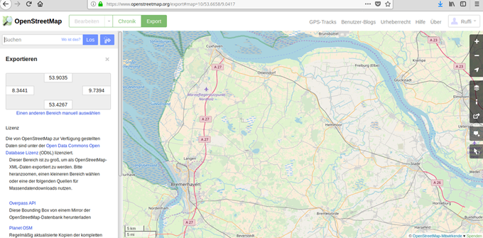
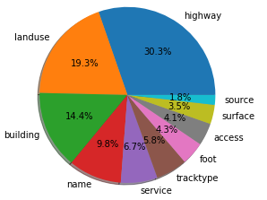
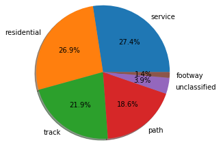
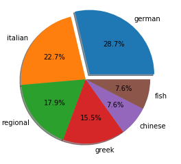
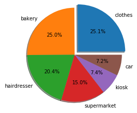
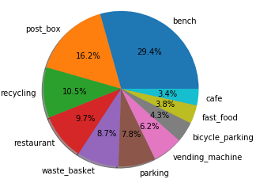

# OpenStreetMap Data Case Study

### Map Area
Landkreis Cuxhaven, Lower Saxony, Germany

- [https://www.openstreetmap.org/export#map=10/53.6658/9.0417](https://www.openstreetmap.org/export#map=10/53.6658/9.0417)



This is the area around my hometown when I was in school and where still my parents live.
Indeed, I am an active OSM member and I did some data creation and editing by myself. 
My OSM user name is "Ruffi", and I am curious to see what kind of editing I did and try to get some statistics.

### Script overview

Note that 2 scripts where run with python2, since the udacity input code to convert xml to csv and to set up the sql database is written in python 2. The assessment is done with python3, since it is my preferred version. I would recommend udacity to change the input scripts to python3.

List of scripts within the project:
- sample_py2.py -> down sizing of .osm file (python2)
- 01_unique_tags.py -> count unique tags (python3)
- 02_problematic_tags.py -> list problematic tags (python3)
- 03_audit_streetname.py -> audit street names (python3)
- 04_audit-Postcode.py -> audit post codes (python3)
- 11_data_2_csv_py2.ipynb -> convert xml data to csv files (python2)
- 13_build_sql_py2.ipynb -> set-up sql database (python2)
- 15_query_py3.ipynb -> SQL queries of the choosen data set (python3)

### References:
- https://github.com/pratyush19/Udacity-Data-Analyst-Nanodegree/tree/master/P3-OpenStreetMap-Wrangling-with-SQL
- Udacity course input

## Problems Encountered in the Map
I started by downloading a big size of the area ("cuxhaven.osm" - ca. 560MB) and running it against the proposed script "sample.py" in order to devide data by factor 50. The resulting file  "cuxhaven_sample_50.osm" with reduced file size of ca. 11MB is part of the project delivery. The reviewer might need to change this naming to get the scripts running.

Regaring data clean up I concentrated my study on the following topics:

- Street name consistency *(for example abbreviations like “Hauptstr.”)*, see "03_audit_streetname.py"
- Inconsistent postal codes *(“28226” is expected)*, see "04_audit-Postcode.py"

### Street name consistency

Street names in german are set together in a quite complicated way. The oficial rules are listed in this reference:

https://www.duden.de/sprachwissen/rechtschreibregeln/strassennamen

In  nutshell, you can expect all kind of settings, like:
"Hauptstraße" (general case)
"Leipziger Straße" (Leipzig is a city, causing an expection to seperate "Straße") 
"Georg-Büchner-Straße" (Georg Büchner is a person, causing an expection to use "-")

As one can see, the auditing script used in the Udacity course to collect "unexpected" street names does not apply for german street names. For this reason the "expected" street names are commented in the script. 

To automatize a correction function to check for the applicable rule for a certain street name is very ambicious and would cetainly exceed the time related to this project.

Anyhow, we can check for more obvious mistakes, like abbreviations or mistypes.
Abbreviations are in general not allowed in German Streetnames, of course with a few exceptions.
The german openstreetmap abbreviation list can be found here:

https://wiki.openstreetmap.org/wiki/Name_finder:Abbreviations#Deutsch_-_German

One can see that abbreviations are either followed by a "." (excepection Bhf = Bahnhof = railway station) or written in capital latters. Multiple grouped capital letters are in german only used for this purpose to my knowledge.

Following function is used to update the street names not matching the rules:

```python 
def update_name_german(name, streetmapping):
    better_name_german = name
    if name in streetmapping:
        better_name_german = streetmapping[name]
    return better_name_german
```

This updated all substrings in problematic address strings, such that:
*“"Neukloster Str.”* becomes: *“"Neukloster Straße”*
and 
*“KIefhorst”* becomes: *“Kiefhorst”*


### Postal Codes
A 5­digit zip code is the german standard, see following reference:
https://de.wikipedia.org/wiki/Postleitzahl_(Deutschland)
There are no exceptions for this rule.

Regex to search for vioaltion of this rule:
```python
street_type_re = re.compile(r'[^\d]{5}', re.IGNORECASE)
```
The auditing script did not find any violation of this rule.

SQL query to get most used post codes:
```python
def postcode():
    postcodes = []
    for row in cur.execute('SELECT tags.value, COUNT(*) as count \
        FROM (SELECT * FROM nodes_tags UNION ALL SELECT * FROM ways_tags) tags \
        WHERE tags.key="postcode" \
        GROUP BY tags.value \
        ORDER BY count DESC \
        LIMIT 10;'):
        postcodes.append(row)
    return postcodes
```

Here are the top ten results, beginning with the highest count:

```sql
value|count
28205|900
28208|388
28206|268
28202|204
28204|196
28216|174
28211|148
28203|120
28209|104
28207|86
```


# Data Overview
This section contains information about the dataset size.

## File sizes
```
cuxhaven.osm ......... 561 MB
cuxhaven_sample_50.osm 11 MB
cuxhaven.db .......... 388 MB
nodes.csv ............. 192 MB
nodes_tags.csv ........ 11 MB
ways.csv .............. 25 MB
ways_tags.csv ......... 36 MB
ways_nodes.cv ......... 78 MB  
```  
## SQL queries to describe the size of the dataset
### Number of nodes
```python 
def number_of_nodes():
	result = cur.execute('SELECT COUNT(*) FROM nodes')
	return result.fetchone()[0]
```
Number of nodes:  2394422

### Number of ways
```python 
def number_of_ways():
	result = cur.execute('SELECT COUNT(*) FROM ways')
	return result.fetchone()[0]
```
Number of ways:  433283

```python 
def number_of_unique_users():
	result = cur.execute('SELECT COUNT(DISTINCT(e.uid)) \
            FROM (SELECT uid FROM nodes UNION ALL SELECT uid FROM ways) e')
	return result.fetchone()[0]
```
Number of unique users:  2256

## This section contains the SQL queries used to get some statictics about topics of my personal interest.

### Top 10 contributing users
```python 
def top_contributing_users():
	users = []
	for row in cur.execute('SELECT e.user, COUNT(*) as num \
            FROM (SELECT user FROM nodes UNION ALL SELECT user FROM ways) e \
            GROUP BY e.user \
            ORDER BY num DESC \
            LIMIT 10'):
		users.append(row)
	return users
```

```python
[('OSchlüter', 443638), ('Findeschorse007', 307039), ('SiegiB', 286162), ('Kohlmeise', 96552), ('Omegatherion', 87214), ('schmarn', 79006), ('mighty_eighty', 71773), ('Joke123', 70543), ('Chrisuu', 63364), ('westnordost', 50719)]
```
### My personal contribution to the OSM database in this area
```python 
def my_user_entries():
    result = cur.execute('SELECT (SELECT count(*) \
        FROM nodes \
        WHERE user = "Ruffi") + \
        (SELECT count(*) \
        FROM ways \
        WHERE user = "Ruffi")')
    return result.fetchone()[0]
```
My total user entries:  12308

### My way entries: Most used keys
```python 
def myuser_way_keys():
    myuser_way = []
    for row in cur.execute('SELECT ways_tags.key, COUNT(*) as num \
        FROM ways, ways_tags \
        WHERE ways.user = "Ruffi" \
        AND ways.id = ways_tags.id \
        GROUP BY ways_tags.key \
        ORDER BY num DESC \
        LIMIT 10;'):
        myuser_way.append(row)
    return myuser_way
```


### What kind of highways did I mostly create?
```python 
def myuser_highway():
    myuser_highways = []
    for row in cur.execute('SELECT ways_tags.value, COUNT(*) as num \
        FROM ways, ways_tags \
        WHERE ways.user = "Ruffi" \
        AND ways_tags.key="highway" \
        AND ways.id = ways_tags.id \
        GROUP BY ways_tags.value \
        ORDER BY num DESC \
        LIMIT 6;'):
        myuser_highways.append(row)
    return myuser_highways
```


### Top 6 cuisines
As all around the world, the italian food is very popular in this area as well:
```python 
def popular_cuisines():
    cuisines = []
    for row in cur.execute('SELECT nodes_tags.value, COUNT(*) as num \
            FROM nodes_tags \
            JOIN (SELECT DISTINCT(id) FROM nodes_tags WHERE value="restaurant") i \
            ON nodes_tags.id=i.id \
            WHERE nodes_tags.key="cuisine" \
            GROUP BY nodes_tags.value \
            ORDER BY num DESC \
            LIMIT 6'):
            cuisines.append(row)
    return cuisines
```
```python 
Popular cuisines:  [('german', 72), ('italian', 57), ('regional', 45), ('greek', 39), ('chinese', 19), ('fish', 19)]
```


### Top 6 shops
Clothes, bakery and hair dresser are the most often shops. 
This is in line with my observations when I walk through the city.
```python 
def popular_shops():
    shops = []
    for row in cur.execute('SELECT value, COUNT(*) as num \
        FROM nodes_tags \
        WHERE key="shop" \
        GROUP BY value \
        ORDER BY num DESC \
        LIMIT 6;'):
        shops.append(row)
    return shops
```
```python 
Popular shops:  [('clothes', 276), ('bakery', 275), ('hairdresser', 224), ('supermarket', 165), ('kiosk', 81), ('car', 79)]
```


### Top 6 ammenities tags
```python 
def common_ammenities():
    ammenities = []
    for row in cur.execute('SELECT value, COUNT(*) as num \
        FROM nodes_tags \
        WHERE key="amenity" \
        GROUP BY value \
        ORDER BY num DESC \
        LIMIT 10;'):
        ammenities.append(row)
    return ammenities
```



# Additional Ideas (project update version 2)

## Opening hours definition

One of the informations I find most important for shops and restaurants is the opening hours.
I use this information a lot, and most of the time I get it from google maps.
The reson for this is that google maps provides very realiable data. Google achieves this by involving the app end-user into the data validation prcoess. You might have noticed that from time to time the google maps app is asking you questions, like if the shown opening hours are correct. In this way google gets the best information possible, especially if you think about the fact that opening hours change quite often.

Let's see how good OSM is in this perspective.
The following queries check for the total number of restaurants with and w/o opening hours information:


```python 
def openhour_yes():
    result = cur.execute('SELECT COUNT(*) \
            FROM nodes_tags \
            JOIN (SELECT DISTINCT(id) FROM nodes_tags WHERE value="restaurant") i \
            ON nodes_tags.id=i.id \
            WHERE nodes_tags.key="opening_hours"')
    return result.fetchone()[0]

def openhour_no():
    result = cur.execute('SELECT COUNT(*) \
            FROM nodes_tags \
            JOIN (SELECT DISTINCT(id) FROM nodes_tags WHERE value="restaurant") i \
            ON nodes_tags.id=i.id')
    return result.fetchone()[0]
``` 

Results:
Restaraunts with opening hours entry:  167
Restaraunts w/o opening hours entry:  4169


It is quite obvious that the OSM dataset is very poor in terms of opening hours.
How could this be improved?
I think the google way is really the best way to encourage users to provide feedback (is this information correct?) or to share information (can you tell me the opening hours of this restaurant?)
My idea would be an OSM app, which accesses the GPS location of the device and gives the user a task to insert missing information, like missing opening hours for a shop.
For each information the user provides, he will receive credits or earn level ups, like it is done in many projects as these times.


# Conclusion
After this review of the data I feel very motivated again to do some OSM editing.
The assessment of the data linked to my OSM user shows that I did mostly contribute "way" data. Most of the nodes I created have no tags, but are linked to ways. These ways are most often linked to highways, landuse and buildings. 
I have concentrated my OSM contribution to smaller road tpyes, like service, residential, track and path.
This is due to the fact that I do a lot of mountainbiking and thus I ride and know many of these smaller roads.

The data cleaning exercise showed that the overall quality of the street names and post code is excellent.This german OSM community is very active and accurate. 
 
